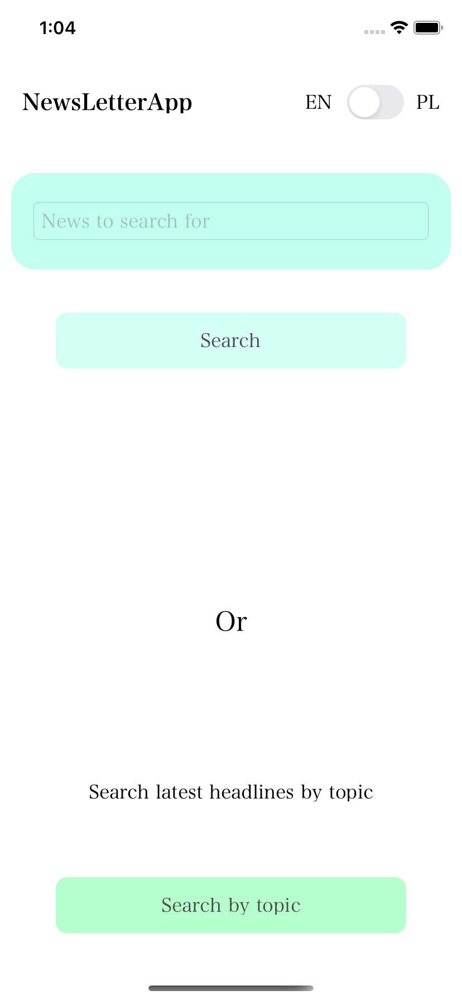
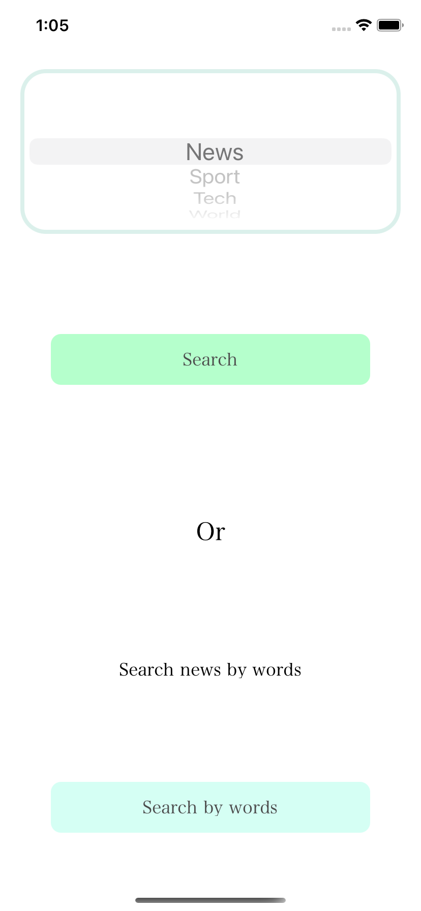
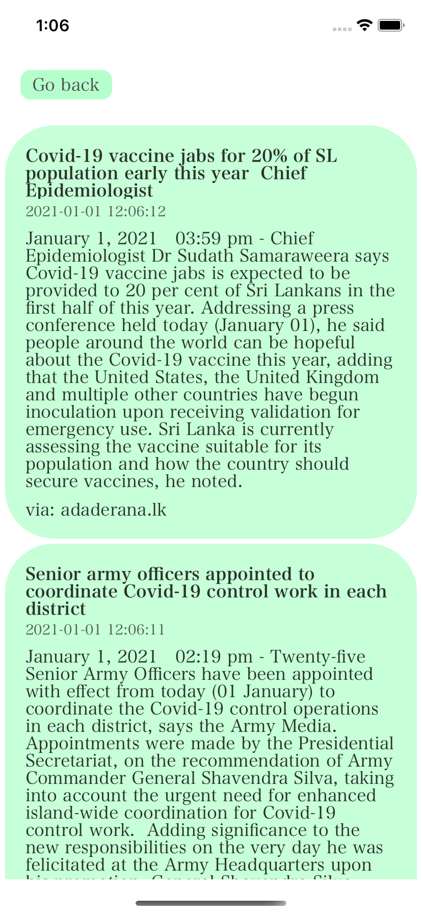
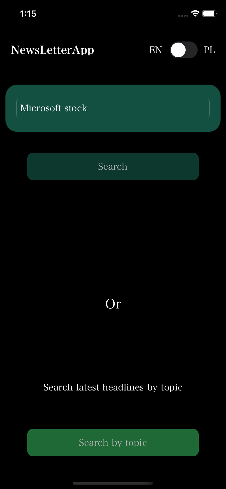
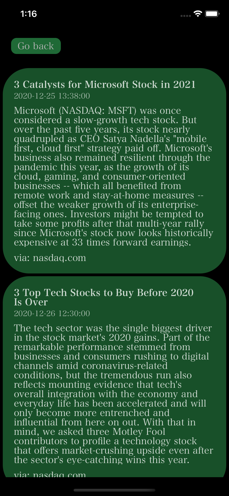
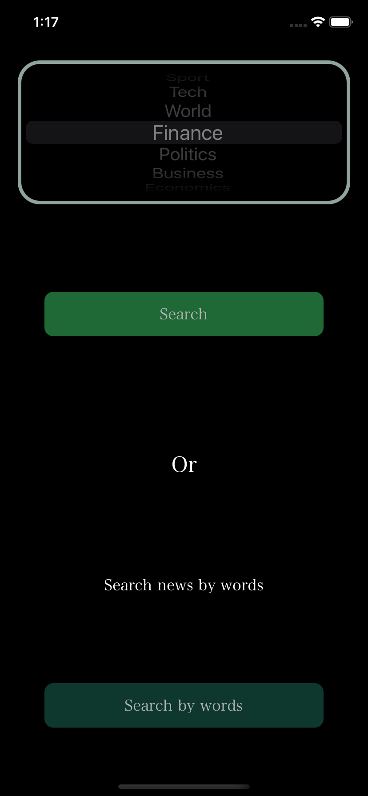
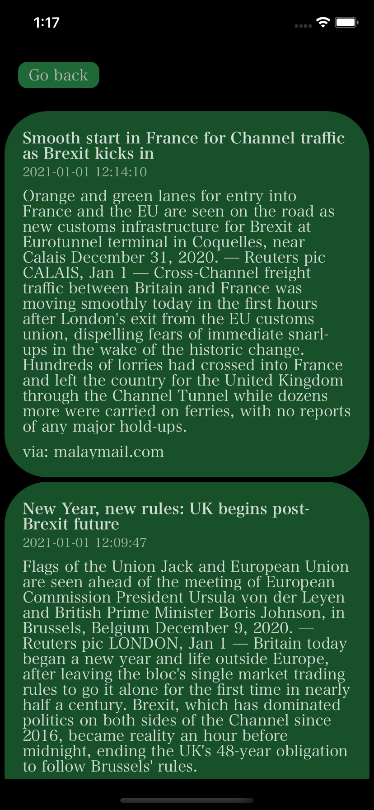

# NewsLetterApp

## General info
News browsing native IOS app created for university project.

## Technologies
Project is created with:
* Swift 5

## Documentation
- [PDF file with documentation](./Documentation/NewsLetterApp_Documentation.pdf)
- [UML diagrams](./Documentation/UML/)

## Screens from the application

  
Expand

  <h2>Light theme</h2>
  

    
    
    
    
  

  
  <h2>Dark theme</h2>
  

    
    
    
    
  

